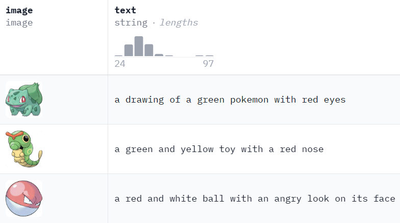
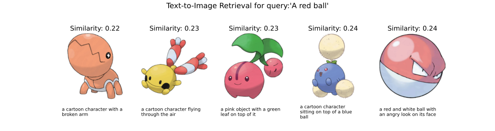

# Artificial Intelligence-Homework 2

**Name：**张弛（ZHANG Chi）

**SID：**12110821

**Link of pull request: ** [Zhang Chi 12110821 ](https://github.com/SustechSTA303/STA303-Assignment02/pull/32)


## Introduction

In this assignment, I test performance of CLIP in **Text-to-Image Retrieval** and compared it to a baseline model. 

- Scenario: Retrieve images based on textual descriptions.

-	Implementation Steps:

    - Load the  pre-trained model.
    - Encode textual descriptions and images.
    - Calculate cosine similarity to find the most similar images for a given text.

-  Dataset: The dataset I choose is **Pokemon** in [Hugging Face](https://huggingface.co/datasets/lambdalabs/pokemon-blip-captions). 
   
    
    
	- There are **833** rows in the dataset. For each row the dataset contains `image` and `text` keys. `image` is a varying size PIL jpeg, and `text` is the accompanying text caption. Only a train split is provided.
	
      	> As I don’t need to train the model by myself as well as the task is to enumerate every row of text to find top-K matched images from whole image list, which will occupy a multitude of GPU resources, I choose a small sample data, concentrating on the performance of origin CLIP model. 
      
   - Data is preprocessed in the file`data_preprocess.ipynb`.
   
-  Baseline model: 

  -  A mean pooling operation on the last hidden states of the **BERT model** is used for text encoding. For image encoding, I use a **pre-trained ResNet model** and extract the features from the last fully connected layer. The similarity between text and image embeddings is then computed using cosine similarity.

    ```python
    from transformers import BertModel, BertTokenizer
    text_encoder_bl = BertModel.from_pretrained('baselinemodel/bert-base-uncased')
    tokenizer_bl = BertTokenizer.from_pretrained('baselinemodel/bert-base-uncased')
    
    image_encoder_bl = models.resnet50(pretrained=True)
    
    def encode_text_bl(text):
        ``` ```
    	return outputs 
    
    def encode_image_bl(image):
        ``` ```
        return features.squeeze()
    
    # Function to compute similarity between text and image embeddings
    def compute_similarity_bl(text_features, image_features):
        ``` ```
        return torch.nn.functional.cosine_similarity(normalized_text_features, normalized_image_features, dim=-1)
    ```
  
  -  Considering that the text features have 768 dimensions, and image features have 1000 dimensions, I **project** the text features to the same dimensionality as the image features using a linear layer. Preserves the original information in text features. Matches the dimensionality of image features without information loss.
  
    ```python
    import torch.nn.functional as F
    
    # Function to project text features to match image features dimensionality
    class TextProjection(nn.Module):
        def __init__(self, input_dim, output_dim):
            super(TextProjection, self).__init__()
            self.linear = nn.Linear(input_dim, output_dim)
    
        def forward(self, x):
            return self.linear(x)
    
    # Instantiate the projection layer
    projection_layer = TextProjection(input_dim=768, output_dim=1000).to(device)
    ```
  


##  Experiment

### Similarity of origin text-to-image

To quickly understand the performance of the model on the data, I compute the **similarity score** of text and image of each row.  Then histogram as well as density curve are as follows.


- According to the Visual graphic, CLIP models have higher scores than the baseline model, meaning that they  can be better able to identify features of images as well as text and match them. 
- Besides,  I use `3 different VISUAL_BACKBONE`for clip and they have different performances. Overall, the CLIP in ViT-B/16 and ViT-B/32 are greater than the one using RN50.
- However,  all similarity scores obtained by models are less than 0.5, meaning that all of them are in terrible match. So we can implement the model to do qualitative tasks instead of quantitative tasks, that is, **making comparison among results from single row.** 

### Text-to-Image Retrieval

To  quickly check the capability of **finding image form a specific query**, I did some tests for CLIP(RN50) and Baseline Model. Here is the result(Top 5 images) by querying ‘flying in the sky’.(more on appendix) 

- **CLIP(RN50)**:

	

- **Baseline Model**:

	

It is apparent that CLIP can **catch the key word `flying`**and be more competitive in retrieval, while Baseline Model could not extract the text feature exactly. 

Then I design an experiment to quantify the performance of text-to-image-retrieval:

1.	For each text and one row, compute its similarity between all image, then we get a  similarity list with length 833.
2.	Get the top-K (5 by default ) similarities from the whole list.
3.	If the top-K images (from top-K similarities) contain the origin image corresponding to the text in raw data, add 1 point to the model.
4.	After enumerating  all text, compute scores and accuracy of each model and compare them.

> To simplify the the whole experiment, I only add one point to the successful retrieval. In fact, we can explore more by modifying the top-K or assigning score differently(5 points to the circumstance that  origin image in the first place, 4 points to the circumstance that  origin image in the second place, etc.). 


The figure below has demonstrated scores(orange) and accuracy(green) attained by each model. Based on the pictured information, Baseline model has worst performance among four models, with 6 successfully retrieval in 833 times. And  CLIP(ViT-B/16) has get greatest score, then CLIP(ViT-B/32) and CLIP(RN50), with score in 400, 376, 339 respectively.

Actually, the retrieval here is just find the most appropriate images in finite data,  which is  inclined to be a multi-classification task rather than a text-to-image retrieval task, even though there are 833 labels. And Taking a consideration that uses it in the real-world online retrieval, this kind of image search method is **less effective**. 


## Conclusion

The experiment has provided valuable insights into the performance of CLIP in the context of Text-to-Image Retrieval using the Pokemon dataset. The findings emphasize the importance of validating CLIP's capabilities on new datasets to understand its generalization and limitations.

### Key Findings:

1. **CLIP Performance:**
	- CLIP, especially with Vision Transformer backbones (ViT-B/16 and ViT-B/32), showcased superior performance in text-to-image retrieval compared to the baseline model.
	- The qualitative tests and quantitative experiment indicated that CLIP models can effectively capture contextual information from textual descriptions to retrieve relevant images.
2. **Challenges and Limitations:**
	- The experiment revealed challenges in achieving high similarity scores, suggesting potential areas for improvement in the accuracy of text-to-image matching.
	- The small size of the dataset and the need for fine-tuning highlight the importance of considering dataset characteristics for optimal model performance.

### Recommendations for Further Investigations:

1. **Diverse Datasets: **Validate CLIP's performance on diverse dataset with varying characteristics to assess its generalization across different domains.
2. **Fine-Tuning Strategies:** Explore fine-tuning strategies to enhance CLIP's performance on specific tasks or domains, considering the unique features and challenges of the target dataset.
3. **Hyperparameter Tuning:** Conduct thorough hyperparameter tuning experiments to identify optimal settings for the CLIP models, addressing challenges in obtaining high similarity scores.
4. **User Feedback and Qualitative Analysis:** Incorporate user feedback and conduct qualitative analysis of retrieval results to gain insights into subjective aspects that quantitative metrics may not capture.
5. **Real-World Deployment Considerations:** Assess the run time efficiency and computational requirements of CLIP models for potential real-world deployment, considering practical constraints and resource availability.

In conclusion, while CLIP has shown promise in the Text-to-Image Retrieval task, further investigations and refinements are crucial for optimising its performance on new datasets. The experiment serves as a starting point, and ongoing research will contribute to unlocking the full potential of CLIP in various applications.


## Appendix

In this part, I showed more queries result from clip and baseline model.

### Mouth open

- **CLIP(RN50)**


add some noise:


- **Baseline model**


### A yellow cat

- **CLIP(RN50)**


- **Baseline model**


### A red ball

- **CLIP(RN50)**




- **Baseline model**


